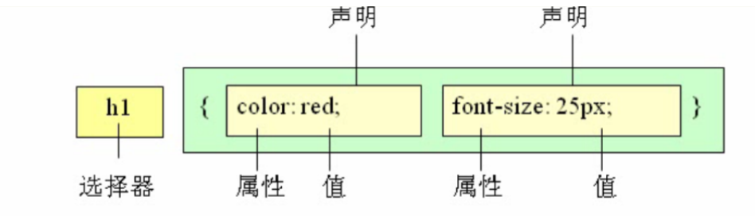

### 定义
CSS(Cascading Style Sheets)，通常称为CSS样式表或层叠样式表

### 作用
用于设置HTML页面的显示样式

### 规则

1. 选择器用于指定CSS样式作用的HTML对象，花括号内是对该对象设置的具体样式
2. 属性和属性值以“键值对”的形式出现
3. 属性是对指定的对象设置的样式属性，例如字体大小、文本颜色等
4. 属性和属性值之间用英文“:”连接
5. 多个“键值对”之间用英文“;”进行区分

### 注释
css中注释使用 `\* *\`