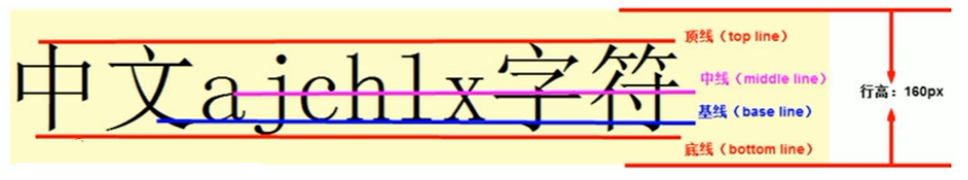
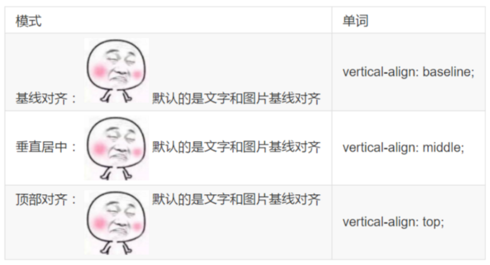

### 字体

#### font-size

* 字体大小
* 单位： px或em
* 尽量使用偶数的数字字号，不能过大或过小

#### font-family

* 字体
* 可以同时指定多个字体，中间以逗号隔开，如果浏览器不支持第一个字体，则会尝试下一个，直到找到合适的字体
* 当需要设置英文字体时，英文字体名必须位于中文字体名之前
* 在文件编码不匹配时写中文字体会产生乱码的错误，这时可以使用Unicode编码表示中文字体

#### font-weight

* 字体粗细，也可以用\<em>标签
* 可选值：lighter, normal, bold, bolder, 100-900(100的倍数)

#### font-style

* 字体样式，一般只用来设置斜体，也可以用\<i>标签
* 可选值：normal, italic

-----------------------------------------

### 文本

#### color

* 定义文本的颜色
* 可选值
    * 预定义的颜色值: red, blue, orange
    * 十六进制: #FF0000，#FF6600，#29D794
    * RGB(A)代码: rgb(255,0,0)或rgba(100,0,0,0.7)

#### line-height

* 用于设置行间距，一般称为行高
* 单位：px, em

#### text-align

* 水平对齐方式
* 可选值：left, center, right

#### text-indent

* 用于设置首行文本的缩进
* 单位：px, em, 百分比
* 1em就是一个字的宽度，如果是汉字的段落，1em 就是一个汉字的宽度

#### text-shadow

* 给文字添加阴影效果
* 可选值：水平距离 垂直距离 模糊距离 阴影颜色
* 水平距离和垂直距离必填，模糊距离和阴影颜色选填

#### letter-spacing

* 用于定义字间距，就是字符与字符之间的空白
* 单位：px, em

#### word-spacing

* 用于定义英文单词之间的间距，对中文字符无效
* 单位：px, em

#### word-break

* 处理单词换行方式（仅针对英语单词）
* 可选值
    * normal：按浏览器的默认方式
    * break-all：允许在单词内换行
    * keep-all：只能在半角空格或连接符处换行

#### white-space

* 处理文本换行方式
* 可选值
    * normal：按浏览器的默认方式
    * nowrap：强制在一行显示

#### text-overflow

* 处理文字溢出内容的显示方式
* 可选值
    * clip：不显示省略标记，而是简单的裁剪
    * ellipsis：显示省略标记

--------------------------

### 显示模式

display: block|inline|inline-block

#### block: 块级显示

* 独占一行
* 高度，行高、外边距以及内边距都可以控制
* 宽度默认是容器的100%
* 可以容纳内联元素和其他块元素

#### inline: 行内显示

* 和相邻行内元素在一行上
* 高、宽无效，但水平方向的padding和margin可以设置，垂直方向的无效
* 默认宽度就是它本身内容的宽度
* 行内元素只能容纳文本或则其他行内元素（a标签除外）

#### inline-block: 行内块元素

* 和相邻行内元素（行内块）在一行上,但是之间会有空白缝隙
* 默认宽度就是它本身内容的宽度
* 高度，行高、外边距以及内边距都可以控制

---------------------------------------------------

### 背景

#### background

* 一般用来设置背景颜色和透明度
* 可选值：color: rgba(0,0,0,0.x)
* 背景半透明是指盒子背景半透明， 盒子里面的内容不收影响

#### background-color

* 背景颜色
* 可选值
    * 预定义的颜色值: red, blue, orange
    * 十六进制: #FF0000，#FF6600，#29D794
    * RGB(A)代码: rgb(255,0,0)或rgba(100,0,0,0.7)

#### background-image

* 图片地址
* 可选值: none, url(https://www.image.com/image)
* 可以设置多背景
    ```css
    background-image: url('images/gyt.jpg'),url('images/robot.png');
    ```

#### background-size

* 背景大小
* 可选值: 宽 高
    * 数值: px, em
    * cover: 自动调整缩放比例，保证图片始终填充满背景区域，如有溢出部分则会被隐藏
    * contain: 自动调整缩放比例，一旦宽或高到达容器大小，则不再缩放

#### background-repeat

* 背景是否重复
* 可选值：repeat, no-repeat, repeat-x, repeat-y

#### background-position

* 背景位置，图片偏移
* 可选值: x轴 y轴
    * 数值：px, em
    * 预定值：top, center, bottom, left, right

* background-attachment
    * 背景附着，设置或检索背景图像是随对象内容滚动还是固定的
    * 可选值: scroll, fixed

-------------------------------------

### 元素的显示与隐藏

在CSS中有三个用于控制元素显示和隐藏的属性，它们的要目的是让一个元素在页面中消失，但是不在文档源码中删除

#### display 展示

* 定义：display设置元素展示
* 可选值
    * none: 不显示
    * block: 以块级模式进行显示
    * inline-block: 以行内块模式进行显示
    * inline: 以行内模式进行显示
* 特点：隐藏之后，不再保留位置

#### visibility 可见性

* 定义：visibility设置元素的可见性
* 可选值
    * visible：可见
    * hidden: 不可见
* 特点：隐藏之后，保留位置

#### overflow 溢出

* 定义：设置当对象的内容超过其指定高度及宽度时如何管理内容
* 可选值
    * auto: 超出自动显示滚动条，不超出不显示滚动条
    * visible: 不剪切内容也不添加滚动条
    * hidden: 不显示超过对象尺寸的内容，超出的部分隐藏掉
    * scroll: 不管超出内容否，总是显示滚动条

-----------------------------------

### 鼠标样式

设置在对象上移动的鼠标指针采用何种系统预定义的光标形状

属性名：cursor

可选值
* default 默认
* pointer 可点击 
* move 移动
* text 文本

------------------------------------------------

### 轮廓

绘制于元素周围的一条线，位于边框边缘的外围，可起到突出元素的作用

一般用于突出选中的input框

属性名：outline

可选值：
* color style width
* 0: 设置为0时，则禁用outline

-------------------------


### 防止拖拽文本域

属性名：resize

可选值：none
```html
<textarea  style="resize: none;"></textarea>
```

-------------------------------------

### 垂直对齐

#### 介绍

* 设置对象内容的垂直对齐方式
* vertical-alig不影响块级元素中的内容对齐，它只针对于行内元素或者行内块元素
* 通常用来控制图片和表单等

* 行内、行内块对齐标准
    
#### 属性名与可选值

* 属性名：vertical-align

* 可选值：baseline, top, middle, bottom

#### 图片和文字对齐



#### 去除图片底侧空白缝隙

* 特性：如果一个元素没有基线，比如图片或者表单等行内块元素，则他的底线会和父级盒子的基线对齐，这样会造成一个问题，就是图片底部会有一个空白缝隙

* 解决方法一
    ```css
    img {
      display: block;
    }
    ```
* 解决方法二

    ```css
    img {
      vertical-align: top;
    }
    ```