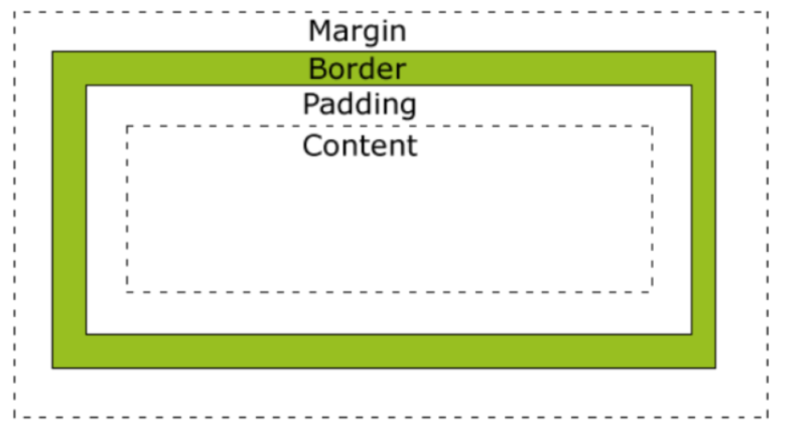

> 盒子模型分为：W3C标准盒模型和IE传统盒模型

### W3C标准盒模型 [content-box]



#### content：盒子中放置的内容（嵌套的内容）
#### padding: 盒子的内边距

| 属性           | 说明                                  |
| -------------- | ------------------------------------- |
| padding-top    | 上内边距                              |
| padding-right  | 右内边距                              |
| padding-bottom | 下内边距                              |
| padding-left   | 左内边距                              |
| padding        | 上内边距 右内边距  下内边距  左内边距 |

| 值的个数 | 表达意思                                     |
| -------- | -------------------------------------------- |
| 1个值    | padding：上下左右边距                        |
| 2个值    | padding: 上下边距 左右边距                   |
| 3个值    | padding：上边距 左右边距 下边距              |
| 4个值    | padding: 上内边距 右内边距 下内边距 左内边距 |

#### border: 盒子的边框

| 属性          | 说明       | 可选值                                                       |
| ------------- | ---------- | ------------------------------------------------------------ |
| border-width  | 边框宽度   |                                                              |
| border-style  | 边框样式   | none, solid, dashed, dotted, double                          |
| border-color  | 边框颜色， | 预定于颜色，16进制颜色，rgb(a)颜色                           |
| border        | 简写模式   | [宽度] [样式] [颜色]                                         |
| border-radius | 圆角的半径 | 四个值：左上角 右上角 右下角 左下角<br />如果某个角没写，则与它的对角相同<br />如果只写一个角，则四个角相同 |

指定特定边框
* border-top: 指定上边框
* border-right: 指定右边框
* border-bottom: 指定下边框
* border-left: 指定左边框

#### margin: 盒子的外边距

| 属性          | 说明                                  |
| ------------- | ------------------------------------- |
| margin-top    | 上外边距                              |
| margin-right  | 右外边距                              |
| margin-bottom | 下外边距                              |
| margin-left   | 左外边距                              |
| margin        | 上外边距 右外边距  下外边距  左外边距 |

| 值的个数 | 表达意思                                    |
| -------- | ------------------------------------------- |
| 1个值    | margin：上下左右边距                        |
| 2个值    | margin: 上下边距 左右边距                   |
| 3个值    | margin：上边距 左右边距 下边距              |
| 4个值    | margin: 上内边距 右内边距 下内边距 左内边距 |

#### margin常用方法

##### margin实现水平居中

```css
margin: 上下外边距 auto;
```

* 必须是块级元素
* 盒子必须指定了宽度

##### 清除元素的默认内外边距

```css
* {
    padding: 0;
    margin: 0;
}
```

#### margin塌陷问题
##### 相邻外边距合并问题

当上下相邻的两个块元素相遇时，如果上面的元素有下外边距margin-bottom，下面的元素有上外边距margin-top，则他们之间的垂直间距不是margin-bottom与margin-top之和，而是两者中的较大者

解决方法：避免就好

##### 嵌套外边距的合并(外边距塌陷)问题

对于两个嵌套关系的块元素，如果父元素没有内边距及边框，则父元素的外边距会与子元素的外边距发生合并，合并后的外边距为两者中的较大者，即使父元素的外边距为0，也会发生合并，合并后子元素的外边距为0


解决方法
* 可以为父元素定义1像素的上边框或上内边距
* 可以为父元素添加overflow:hidden

#### W3C标准盒子大小计算
##### 外盒尺寸计算（元素空间尺寸）

element空间高度＝内容高度＋内距＋边框＋外距

element空间宽度＝内容宽度＋内距＋边框＋外距

##### 内盒尺寸计算（元素大小）

element高度＝内容高度＋内距＋边框

element宽度＝内容宽度＋内距＋边框

-----------------------------------------------------

### IE传统盒模型 [border-box]

#### 与W3C盒模型的联系和区别

与W3C标准盒模型一样都有：margin, border, padding, content

与W3C标准盒模型区别
* IE传统盒模型的width属性包括border, padding和content
* IE传统盒模型的height属性包括border, padding和content

#### 计算IE传统盒模型大小
外盒尺寸计算（元素空间尺寸）
* element空间高度＝内容高度＋外距（height包含了元素内容宽度、边框、内距）
* element宽间宽度＝内容宽度＋外距（width包含了元素内容宽度、边框、内距）

内盒尺寸计算（元素大小）
* element高度＝内容高度（height包含了元素内容宽度、边框、内距）
* element宽度＝内容宽度（width包含了元素内容宽度、边框、内距）

#### 设置使用盒模型

通过设置box-sizing的值，可以选择使用W3C标准盒模型或IE传统盒模型

box-sizing: content-box 使用W3C标准盒模型

box-sizing: border-box 使用IE传统盒模型

---------------------------------------------------

### 盒子阴影

```css
box-shadow: 水平阴影距离 垂直阴影距离 模糊距离 阴影大小 阴影颜色 内/外阴影；
```