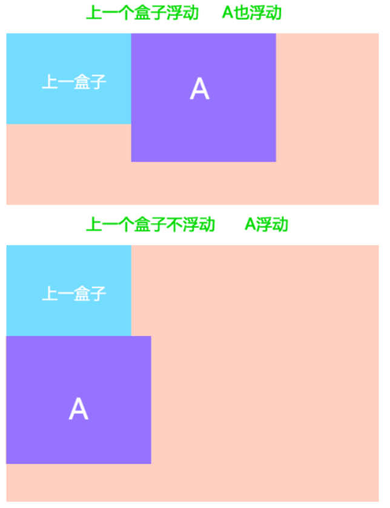
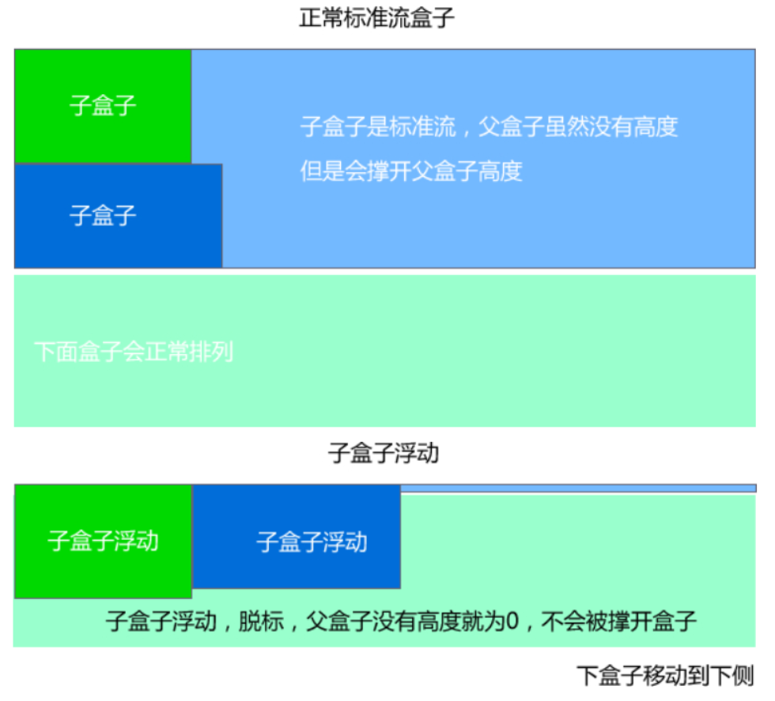

### 文档流是什么
文档流就是一个网页中标签元素正常从上到下，从左到右排列的顺序

比如块级元素会独占一行，行内元素会按顺序依次前后排列

--------------------------------------------------

### 浮动的作用

浮动最早是用来控制图片，以便达到其他元素（特别是文字）实现"环绕"图片的效果

后来人们发现浮动能让任何盒子可以一行排列，所以就开始使用浮动来布局了

-----------------------------------

### 浮动的定义

浮动是指设置了浮动属性的元素会脱离标准普通流的控制，移动到特定位置的过程

-----------------------------------------

### 浮动的规律

浮动的元素总是找理它最近的父级元素对齐，但是不会超出内边距的范围，如果强制超出，则会移动到下面


对于浮动元素A，如果A的上一个元素也浮动，则A元素顶部会和上一个元素的顶部对齐；如果上一个元素是标准流，则A元素的顶部会和上一个元素的底部对齐


元素浮动后，显示模式为inline-block

总结
* 浮：加了浮动的元素盒子是浮起来的，漂浮在其他的标准流盒子上面
* 漏：加了浮动的盒子，不占位置的，它浮起来了，它原来的位置漏给了标准流的盒子
* 特：特别注意，这是特殊的使用，有很多的不好处，使用要谨慎

---------------------------------------------

### 设置浮动

属性名：float

| 属性值 | 说明                 |
| ------ | -------------------- |
| left   | 元素向左浮动         |
| right  | 元素向右浮动         |
| none   | 元素不浮动（默认值） |

```css
选择器 {
  float: left|right|none;
}
```

----------------------------------

### 清除浮动

#### 清除浮动是什么

清除浮动的意思是**清除浮动带来的影响**

#### 浮动带来什么影响
因为在使用浮动布局时，很多时候不能确定浮动元素的高度，所以父盒子也不设定高度，由浮动元素的高度决定父盒子的高度

但是这带来一个问题，因为父盒子不设置高度，而浮动元素脱离了文档流，这导致文档流中父盒子后的元素会顶上来，即浮动元素漂浮在父盒子后的文档流元素上，显示有问题，这种问题称为**高度塌陷**

所以需要清除浮动带来的影响



#### 清除浮动的5种方法
##### 让父元素本身也浮动

不推荐，如果父元素本身也浮动，父元素宽度就会随着子元素变化

```css
.father-box {
  float: left;
}
```

##### 额外标签法

使用clear属性，清除浮动带来的影响【W3C推荐做法】

在浮动元素添加一个空的div标签，里面使用clear属性
```html
<div style="clear:both"></div>
```

优点：通俗易懂，书写方便

缺点：添加许多无意义的标签，结构化较差

##### 触发BFC

父盒子使用overflow属性

```css
.father-box {
  overflow: hidden|auto|scroll;
}
```
优点：代码简洁

缺点：内容增多时候容易造成不会自动换行导致内容被隐藏掉，无法显示需要溢出的元素

##### after伪元素法

```css
.clearfix:after {  
  content: "."; 
  display: block; 
  height: 0; 
  visibility: hidden;  
  clear: both; 
}   

.clearfix { /* IE6、7 专用 */
  *zoom: 1;
}
```
优点：结构语义化正确

缺点：由于IE6-7不支持:after，使用 zoom:1触发hasLayout

##### before和after双伪元素法

```css
.clearfix:before,
.clearfix:after { 
  content:".";
  display:table;
}
.clearfix:after {
  clear:both;
}
.clearfix {
  *zoom:1;
}
```
优点：代码更简洁

缺点：由于IE6-7不支持:after，使用 zoom:1触发 hasLayout