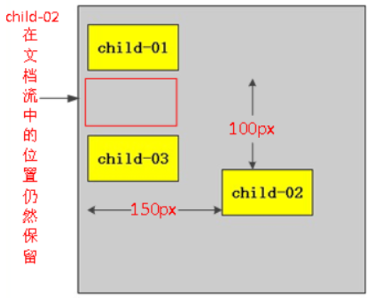

> 定位由边偏移和定位模式决定

### 边偏移

| 边偏移属性 | 描述                                           |
| ---------- | ---------------------------------------------- |
| top        | 顶端偏移量，定义元素相对于其父元素上边线的距离 |
| bottom     | 底部偏移量，定义元素相对于其父元素下边线的距离 |
| left       | 左侧偏移量，定义元素相对于其父元素左边线的距离 |
| right      | 右侧偏移量，定义元素相对于其父元素右边线的距离 |

---------------------------------------------------------

### 定位模式

| 值       | 描述                                             |
| -------- | ------------------------------------------------ |
| static   | 自动定位（默认定位方式）                         |
| relative | 相对定位，相对于其原文档流的位置进行定位         |
| absolute | 绝对定位，相对于其上一个已经定位的父元素进行定位 |
| fixed    | 固定定位，相对于浏览器窗口进行定位               |

------------------------------

### 静态定位 staitc

默认的定位方式

边偏移没有效果

一般用来清除定位

---------------------------------------------------

### 相对定位 relative

相对于自身进行偏移

不脱离文档流，偏移后在文档流中的位置仍然保留


-------------------------------

### 绝对定位 absolute

相对于最近的使用了定位(reletive,absolute,fixed)的父级元素进行偏移，如果所有父级元素都没有使用过定位，则相对于document元素进行偏移

脱离文档流，不保留原始自身位置

-------------------------------------

### 固定定位 fixed

相对于浏览器窗口进行偏移

脱离文档流，不保留原始自身位置

----------------------------------------------------

### 使用定位实现水平和垂直居中对齐

#### 水平居中对齐

```css
positive: absolute;
left: 50%; /* 50%是指父盒子宽度的一半 */
margin-left: -自己的宽度一半;
```

#### 垂直居中对齐

```css
positive: absolute;
top: 50%; /* 50%是指父盒子高度的一半 */
margin-top: -自己高度的一半;
```

-------------------------------------------

### 叠放次序 z-index

在元素之间发生重叠时，可以设置上下顺序

只有相对定位，绝对定位，固定定位有此属性

z-index的默认属性值是0，取值越大，定位元素在层叠元素中越居上，后面数字一定不能加单位

--------------------------------------------

### 定位模式转换

跟浮动一样，元素添加了绝对定位或固定定位(不包括相对定位)之后，元素模式也会发生转换，都转换为行内块模式

因此比如行内元素如果添加了绝对定位或者固定定位后，可以不用转换模式，直接给高度和宽度就可以了