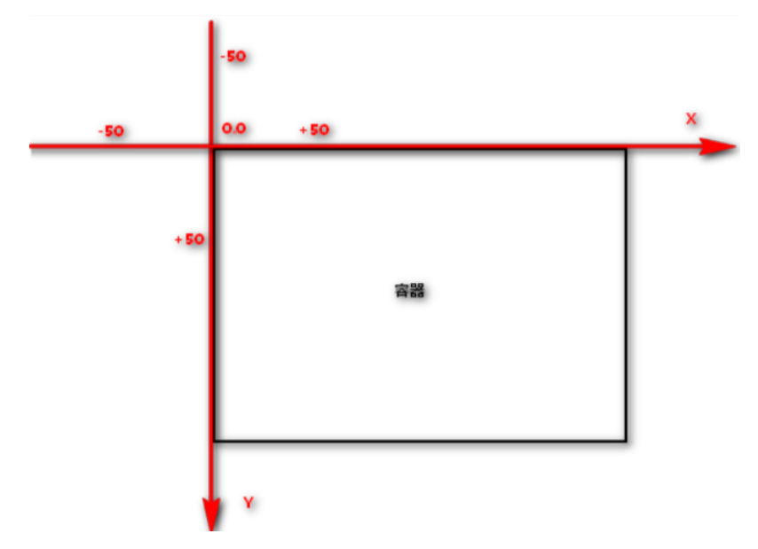
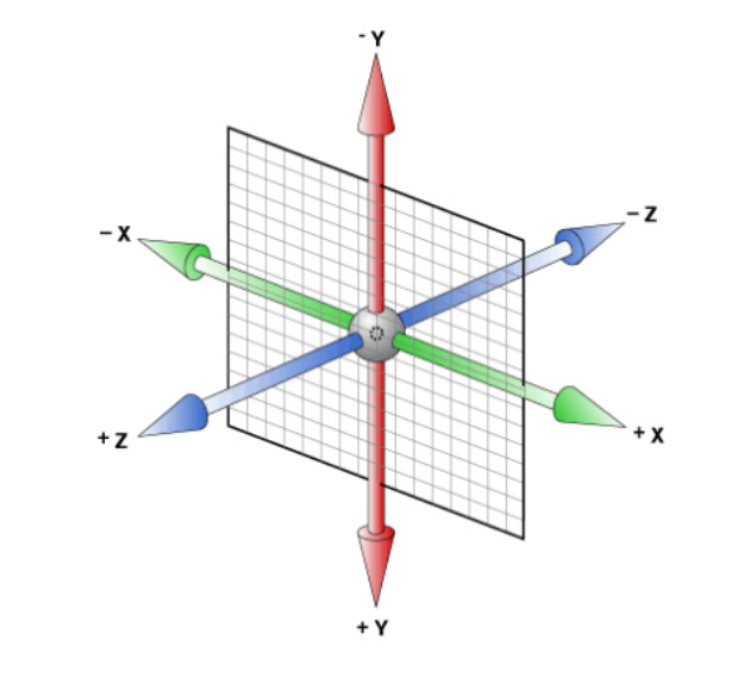

### 2D变形

#### 介绍

transform可以实现元素的位移、旋转、倾斜、缩放

配合过渡和动画，可以取代大量之前只能靠Flash才可以实现的效果

#### 2D坐标轴


#### 移动

| 属性           | 说明                                                 |
| -------------- | ---------------------------------------------------- |
| translate(x,y) | 水平方向和垂直方向同时移动（也就是X轴和Y轴同时移动） |
| translateX(x)  | 仅水平方向移动（X轴移动）                            |
| translateY(y)  | 仅垂直方向移动（Y轴移动）                            |

盒子居中对齐例子
```css
.box {
  width: 499.9999px;
  height: 400px;
  background: pink;
  position: absolute;
  left:50%;
  top:50%;
  transform:translate(-50%,-50%);  /* 走的自己的一半 */
}
```

#### 缩放

| 属性       | 说明                                                       |
| ---------- | ---------------------------------------------------------- |
| scale(x,y) | 使元素水平方向和垂直方向同时缩放（也就是X轴和Y轴同时缩放） |
| scaleX(x)  | 元素仅水平方向缩放（X轴缩放）                              |
| scaleY(y)  | 元素仅垂直方向缩放（Y轴缩放）                              |

默认的值为1，当值设置为0.01到0.99之间的任何值，作用使一个元素缩小，而任何大于或等于1.01的值，作用是让元素放大
```css
transform: scale(0.8,1.2);
```

#### 旋转

可以对元素进行旋转，正值为顺时针，负值为逆时针

单位：deg

##### 示例

顺时针旋转45°
```css
transform: rotate(45deg);
```

逆时针旋转-60°
```css
transform: rotate(-60deg);
```

##### 改变旋转中心

设置transform-origin
```css
transform-origin: left top;
transform-origin: 10px 10px;
```

#### 倾斜

可以使元素按一定的角度进行倾斜
```css
transform:skew(30deg,0deg);
```

-----------------------------------

### 3D变形

#### 3D的坐标轴


#### 移动

| 属性               | 说明             |
| ------------------ | ---------------- |
| translateX(x)      | 沿X轴方向移动    |
| translateY(y)      | 沿Y轴方向移动    |
| translateZ(z)      | 沿Z轴方向移动    |
| translate3d(x,y,z) | 同时设置三轴移动 |

#### 缩放

| 属性             | 说明             |
| ---------------- | ---------------- |
| scaleX(x)        | 沿X轴缩放        |
| scaleY(y)        | 沿Y轴缩放        |
| scaleZ(z)        | 沿Z轴缩放        |
| scale3d(x, y, z) | 同时设置三轴旋转 |

默认的值为1，当值设置为0.01到0.99之间的任何值，作用使一个元素缩小，而任何大于或等于1.01的值，作用是让元素放大

#### 旋转

单位：deg，正值顺时针，负值逆时针

| 属性            | 说明             |
| --------------- | ---------------- |
| rotateX(x)      | 沿X轴旋转        |
| rotateY(y)      | 沿Y轴旋转        |
| rotateZ(z)      | 沿Z轴旋转        |
| rotate3d(x,y,z) | 同时设置三轴旋转 |

#### 透视

电脑显示屏是一个2D平面，图像之所以具有立体感（3D效果），其实只是一种视觉呈现，通过透视可以实现此目的

透视可以将一个2D平面，在转换的过程当中，呈现3D效果
* 透视原理： 近大远小
* 浏览器透视：把近大远小的所有图像，透视在屏幕上
* perspective：视距，表示视点距离屏幕的长短
* 视点：用于模拟透视效果时人眼的位置
