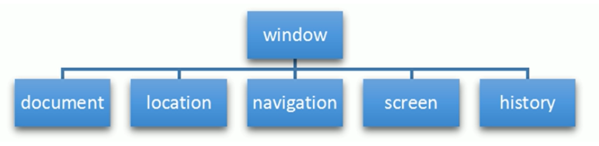

### BOM概述

定义：BOM全称是Browser Object Model，即浏览器对象模型

作用：BOM是JS与浏览器进行交互的媒介

特点：BOM缺乏标准，JS标准化组织是ECMAScript，DOM标准化组织是W3C，而BOM则由浏览器产商自己决定

-------------------------------------------------------

### BOM的组成



window对象是BOM的顶级对象，具有双重角色
* 它是JS与浏览器进行交互的接口，提供了很多内置的属性和函数
* 它是一个全局对象，定义在全局作用域的变量、函数等等都会变成window对象的属性和方法

------------------------------------------------------------------------

### window对象

#### 常用属性

| 属性        | 说明         |
| ----------- | ------------ |
| innerWidth  | 当前屏幕宽度 |
| innerHeight | 当前屏幕高度 |
| pageYOffset |              |
| pageXOffset |              |

#### 常用方法

| 方法    | 说明                        | 返回值       |
| ------- | --------------------------- | ------------ |
| open    | 打开窗口                    |              |
| close   | 关闭窗口                    |              |
| alert   | 警告框，alert("内容")       | 无返回值     |
| confirm | 确认框，confirm("确认内容") | true/false   |
| prompt  | 输入框，prompt()            | 字符串或null |

#### 常用事件

| 事件     | 说明                     | 特点                                                         |
| -------- | ------------------------ | ------------------------------------------------------------ |
| load     | 页面加载完毕时触发       | 只能写一个，如果写了多个，以最后一个为准                     |
| pageshow | 重新加载页面触发的事件   | 和load的区别是为了兼容火狐，因为火狐的后退按钮不能触发load事件 |
| resize   | 窗口大小变化时触发       | 能够实现响应式布局                                           |
| onscroll | 窗口滚动时触发的回调函数 |                                                              |

与load功能类似的DOM事件
* DOMContentLoaded：仅当DOM加载完毕时执行，不管此时图片，样式等是否已经加载完毕
* load：当页面全部加载完毕后才执行，即执行时，DOM、图片、样式表等均已加载完毕

------------------------------------------------------------

### location对象

window对象给我们提供了一个location属性，它用于获取或设置窗体的URL，并且可以用于解析URL，因为这个属性返回一个对象，所以称为location对象

#### location对象常用属性

| 属性              | 说明                    |
| ----------------- | ----------------------- |
| location.href     | 获取或设置整个URL       |
| location.host     | 返回host                |
| location.port     | 返回端口                |
| location.pathname | 返回路径                |
| location.search   | 返回参数                |
| location.hash     | 返回片段，即#之后的内容 |

#### location对象常用方法

| 方法                        | 说明                                           |
| --------------------------- | ---------------------------------------------- |
| location.assign(URL)        | 跟href，重定向页面，可以后退                   |
| location.replace(URL)       | 替换当前页面，因为不记录历史，所以不能后退页面 |
| location.reload(true/false) | 刷新页面,true为强制刷新清除缓存，false普通刷新 |

---------------------------------------------------------

### navigator对象

navigator对象包含浏览器的相关信息，最常用的是userAgent，该属性能够返回由客户端发送给服务器的user-agent头部的值，从而可以识别用户是通过PC访问，还是移动端设备访问

```js
const userAgent = window.navigator.userAgent;

const regExp = /(phone|pad|pod|iPhone|iPod|ios|iPad|Android|Mobile|BlackBerry|IEMobile|MQQBrowser|JUC|Fennec|wOSBrowser|BrowserNG|WebOS|Symbian|Windows Phone)/i;
if(userAgent.test(regExp)) {
    window.location.href = ""; // 手机
} else {
    window.location.href = ""; // 电脑
}
```

------------------------------------------------------------------------

### history对象

history对象记录了浏览器的历史记录，包含用户访问过的URL

| 方法      | 说明                                                     |
| --------- | -------------------------------------------------------- |
| back()    | 后退                                                     |
| forward() | 前进                                                     |
| go(参数)  | 参数如果是1，则前进1个页面，参数如果是-1，则后退一个页面 |

-----------------------------------------------------------------------

### Cookie

#### 定义

Cookie是用来保存信息的，因为http协议是无状态的，所以需要将一些信息保存在客户端，比如保存用户名和密码，避免用户切换页面时需要重新登录 

#### 特点

一个域名共享一套Cookie，有过期时间，且数量大小有限，4-10k，能防止恶意写入大量数据

#### 使用

| 情况           | 使用                                           | 注意                           |
| -------------- | ---------------------------------------------- | ------------------------------ |
| 获取cookie对象 | let cookieObj = document.cookie;               |                                |
| 设置cookie     | document.cookie = "key=value;expired=" + date; | = 号是添加，不是覆盖赋值       |
| 读取cookie     | 通过 split 函数来获取                          |                                |
| 删除cookie     | 设置cookie过期时间为-1                         |                                |
| 获取过期时间   | date.setDate(date.getDate() + 天数);           | 返回值就是目标日期的 Date 对象 |

-----------------------------------------------------------

### 定时器

> 定时器只要开和关，没有暂停重启的概念 

#### setTimeout

| 定义                            | 作用           | 返回值                               |
| ------------------------------- | -------------- | ------------------------------------ |
| setTimeout( 回调函数, 定时毫秒) | 一直循环执行   | 该定时器的ID，可以通过ID清除该定时器 |
| clearTimeout(定时器ID)          | 清除setTimeout |                                      |

#### setInterval

| 定义                          | 作用               | 返回值                               |
| ----------------------------- | ------------------ | ------------------------------------ |
| setInterval(函数名, 定时毫秒) | 定时完成后执行一次 | 该定时器的ID，可以通过ID清除该定时器 |
| clearInterval(定时器ID)       | 清除setInterval    |                                      |