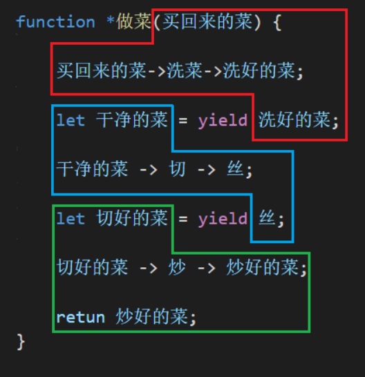

### Generator简介
异步编程的一种解决方案

-------------------------------------------------

### 定义生成器函数

在函数名前加上 * 号，表示这个函数是一个生成器函数，它可以返回生成器对象
```js
function *show() {} // 加 * 表示是生成器函数
```

不能使用箭头函数定义生成器函数 

```js
*() => {} // error
```

----------------------------------------------------

### 创建生成器对象

调用生成器函数创建生成器对象

在创建生成器对象时，会执行生成器函数开头到第一yield之间的代码

------------------------------------------------

### 使用生成器对象

调用生成器对象的next方法，可以执行下一个代码片段（以yield为分割点）

-----------------------------------------

### yield关键字
yield取放弃的意思，它是代码片段与代码片段之间的分隔点，作为承上启下的角色

yield可以接收参数，也可以返回值，上一个步骤的返回值是下一个步骤的参数

-------------------------------

### Generator示例


红色框：创建生成器对象时执行

蓝色框：生成器对象第一次调用next方法时执行

绿色框：生成器对象第二次调用next方法时执行