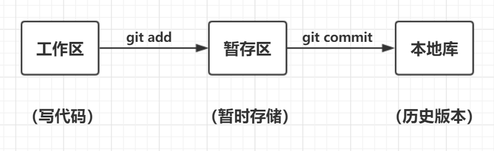

### git区域组成

工作区 ---(add)---> 暂存区 ---(commit)---> 本地库

示意图

命令行提示颜色：工作区是红色，暂存区是绿色

 

### git配置

git在使用前要配置使用者的信息，包括用户名和邮箱

三种级别的配置

| 分类     | 说明                                   | 配置                                                         | 配置文件存放路径 |
| -------- | -------------------------------------- | ------------------------------------------------------------ | ---------------- |
| 系统级别 | 同计算机所有账号的仓库都使用这份配置   | git config --global user.name "tom" git config --global user.email "tom@email.com" | /etc/.gitconfig  |
| 全局级别 | 同系统账号下的不同的仓库都使用这份配置 | git config --local user.name "tom" git config --local user.email "tom@email.com" | ~/gitconfig      |
| 仓库级别 | 只有当前仓库使用这份配置               | git config --local user.name "tom" git config --local user.email "tom@email.com" | ./.git/config    |

匹配顺序：仓库级别 > 全局级别 > 系统级别

配置项：

* 用户名：user.name
* 邮箱：user.email
* 远程库地址：git remote add origin URL路径

 

### .gitignore

作用：用于忽略追踪，即在**.gitignore**文件中注明的某个文件或某类文件将被git所忽略

位置：**.gitignore**文件与**.git**放在同一个目录下

切记：不要管理敏感信息

自定义匹配规则

* 对于文件

  | 规则           | 例子                                                         |
  | -------------- | ------------------------------------------------------------ |
  | 匹配完整文件名 | a.js // 不管理a.js b.go // 不管理c.go .gitignore // 不管理.gitignore |
  | 匹配后缀       | *.js // 不管理js源码 *.go // 不管理go源码                |

* 对于文件夹

  | 规则             | 例子                                                     |
  | ---------------- | -------------------------------------------------------- |
  | 匹配完整文件夹名 | files/ node_modules/                                 |
  | 取反，使用**!**  | files/ !files/a.js # files中除了 a.js 外都不进行管理 |
