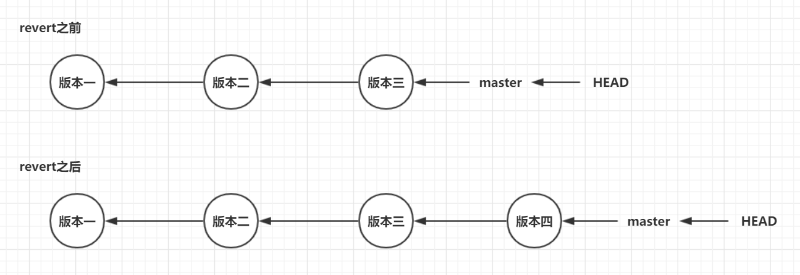

### 基础命令

| 功能                           | 命令                            | 注意事项                                                     |
| ------------------------------ | ------------------------------- | ------------------------------------------------------------ |
| 本地仓库初始化                 | git init                        | **.git**文件夹中存放git工作所需要的信息，不能删除和随意更改该文件夹 |
| 本地仓库状态查看               | git status                      |                                                              |
| 将文件添加到暂存区             | git add [filename]              |                                                              |
| 将文件由暂存区添加到本地库     | git commit -m "信息" [filename] |                                                              |
| 将更改后的文件直接添加到本地库 | git commit -m "信息" -a         | 必须是之前已经在本地库中的文件才能使用                       |

<br/>

### 版本快照与索引值

git用快照的方式管理数据，每次提交时git都会对全部文件制作一个对应的快照，并用哈希算法(sha-1)生成唯一的标识值，称为版本号

git中有个 HEAD 指针指向某个版本号，表示当前工作区中是哪一个快照(版本)，**一个commit对应一个版本**

为了高效，如果文件没有被修改，git不再生成新的快照，而是保存一个链接，链接指向之前的快照

快照示意图


<br/>

### 提交历史查看

| 命令                                    | 特点                                     | 能否看见【未来】                           |
| --------------------------------------- | ---------------------------------------- | ------------------------------------------ |
| git log                                 | 最详细，内容最多                         | 只能看到过去的记录，看不到【未来】的记录   |
| git log --pretty=oneline                | 简略版，版本号完整                       | 只能看到过去的记录，看不到【未来】的记录   |
| git log --oneline                       | 简略版，版本号只有开头                   | 只能看到过去的记录，看不到【未来】的记录   |
| git log --graph --pretty=format:"$h %s" | 以图形展示多分支情况下的提交             | %h：哈希值，%s提交记录                     |
| git reflog                              | 简略版，版本号只有开头，附带版本移动步数 | 既能看到过去的记录，又能看到【未来】的记录 |

【未来】的含义：【未来】不是指实际物理时间的未来，而是指当前版本的未来，比如现在有版本A->B->C，A最老，C最新，现在由版本C切换为B，则命令1，2，3都只能看到记录A和B，看不到C，而命令4能看到记录A，B，C

<br/>

### 版本切换

#### git reset

```shell
git reset --[hard|mixed|soft] 版本号
```

| 切换方法   | 命令                                   | 说明                                 |
| ---------- | -------------------------------------- | ------------------------------------ |
| 通过版本号 | git reset --[hard\|mixed\|soft] 版本号 | 通过提交历史命令查看快照对应的版本号 |
| 通过HEAD^  | git reset --[hard\|mixed\|soft] HEAD^^ | 一个^表示回退一个版本                |
| 通过HEAD~  | git reset --[hard\|mixed\|soft] HEAD~n | n表示回退n个版本                     |

###### hard|mixed|soft的说明

--soft：工作区移动，暂存区，本地库都不移动


--mixed：工作区，暂存区都移动，本地库不移动


--hard：工作区，暂存区，本地库都移动


#### git revert

```shell
git revert -n 版本号
```

作用：用于"反转"某一个版本，以达到撤销特定版本的目的

使用场景：如果想撤销某一版本，但是又想保留该版本后面的版本，同时记录下这整个版本变动流程，就可以用这种方法

特点：使用`git revert`后会生成新的commit(新的版本号)

例子：对于三个版本（版本一、版本二、 版本三），突然发现版本二有bug，想要撤销版本二，但又不想影响撤销版本三的提交，就可以用 git revert 命令来反做版本二，生成新的版本四，这个版本四里会保留版本三的东西，但撤销了版本二的东西



#### reset和revert区别

1. git revert是用一次新的commit来回滚之前的commit，git reset是直接删除指定的commit
2. git reset 是把HEAD向后移动了一下，而git revert是HEAD继续前进，只是新的commit的内容和要revert的内容正好相反，能够抵消要被revert的内容

<br/>

### 文件删除与恢复

| 情况                                       | 对应操作                                              |
| ------------------------------------------ | ----------------------------------------------------- |
| 文件还没提交到暂存区和本地库，想删除       | 直接删除，不涉及任何git操作                           |
| 文件还没提交到暂存区和本地库，删除后想恢复 | 没门，因为根本没用到git管理                           |
| 文件已经提交到暂存区，想删除               | git rm --cached [filename]                            |
| 文件已经提交到暂存区，删除后想恢复         | 再git add一次就好                                     |
| 文件已经提交到本地库，想删除               | git rm [filename]<br/>git commit -m "信息" [filename] |
| 文件已经提交到本地库，删除后想恢复         | git reset --hard 版本号回到最近的旧版本               |

<br/>

### 文件重命名

*  方法一：直接在文件夹中重命名
*  方法二：使用 `git mv oldFile newFile` 进行命名

<br/>

### 文件对比

| 命令                           | 功能                               |
| ------------------------------ | ---------------------------------- |
| git diff [filename]            | 将工作区与暂存区进行对比           |
| git diff \[版本号]  [filename] | 将工作区文件与对应版本文件进行对比 |

不带 [filename] 时，比较全部文件

<br/>

### 分支管理

分支概念：在版本中，能够创建多个副本，在各个副本上可以进行的操作，最后副本可以与主体进行合并

示意图

  

分支优点

* 多线操作，多任务同时推进，提高开发效率
* 开发过程中，如果副本开发失败，则可以直接删除副本，不会对主体造成影响

分支操作

| 操作     | 命令                     | 注意                                                         |
| -------- | ------------------------ | ------------------------------------------------------------ |
| 查看分支 | git branch -v            | 带*号的表示是当前选中分支                                    |
| 创建分支 | git branch [name]        | 在创建分支前需要注意此时git处于哪个分支<br/>因为创建出来的分支会是当前分支的一个快照（即工作区，缓存区和本地库相同） |
| 切换分支 | git checkout [name]      |                                                              |
| 合并分支 | git merge [被合并的分支] | 将"被合并分支"合并到当前分支                                 |
| 删除分支 | git branch -d [name]     |                                                              |

分支冲突

* 冲突概念：当分支1修改了一个地方为A，而分支2修改了一个地方为B，则在合并过程中就会发生冲突，git并不知道以哪个为准，所以git会进入分支冲突处理状态，由人工进行冲突的解决

* 冲突位置：发生冲突的文件，git会标注冲突位置

  ```bash
  >>>>>>>>>> 分支1
  分支1的冲突内容
  ================
  分支2的冲突内容
  <<<<<<<<<< 分支2
  ```

* 冲突解决

  * 人工修改\>>>>>>>与<<<<<<<< 之间的冲突内容
  * git add [filename] 添加修改文件名
  * git commit -m "信息"   不能带具体文件名

<br/>

### 标签

概念：可以为版本起一个名字，即为版本库中打一个标签，一个标签就唯一标识一个版本

本质：就是对快照版本号起一个别名，便于区分和查找

用法：

| 功能             | 命令                                  |
| ---------------- | ------------------------------------- |
| 为当前版本打标签 | git tag [tagname] -m "信息"           |
| 为指定版本打标签 | git tag \[tagname] [索引号] -m "信息" |
| 查看所有标签     | git tag                               |
| 查看标签信息     | git show [tagname]                    |
| 删除标签         | git tag -d [tagname]                  |

标签与远程库的关系
* 创建的标签都只存储在本地，不会自动推送到远程 
* 推送特定标签到远程库：git push origin [tagname]
* 推送全部标签到远程库：git push origin --tags
* 删除远程库的标签
  * 首先删除本地标签：git tag -d [tagname]
  * 然后删除远程库标签：git push origin :refs/tags/[tagname]

<br/>

### 保存隐藏工作区

| 命令                         | 功能                                                         |
| ---------------------------- | ------------------------------------------------------------ |
| git stash                    | 暂时保存隐藏工作区到列表中                                   |
| git stash save "message"     | 暂时保存隐藏工作区到列表中，且标注了提示信息                 |
| git stash list               | 查看列表中被保存隐藏的工作区                                 |
| git stash show               | 显示第$num个存储做了哪些改动                                 |
| git stash pop                | 从列表中弹出被保存隐藏的工作区                               |
| git stash apply stash@{$num} | 应用某个存储，但不会把存储从存储列表中删除<br/>默认使用第一个存储,即stash@{0}<br/>如果要使用其他存储，git stash apply stash@{$num} |
| git stash drop stash@{$num}  | 丢弃stash@{$num}存储，从列表中删除这个存储                   |
| git stash clear              | 删除所有缓存的stash                                          |