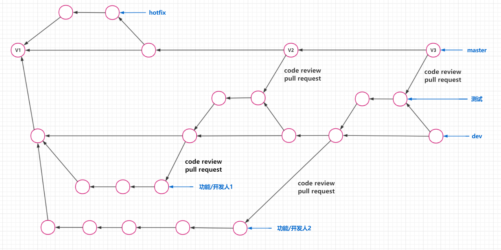
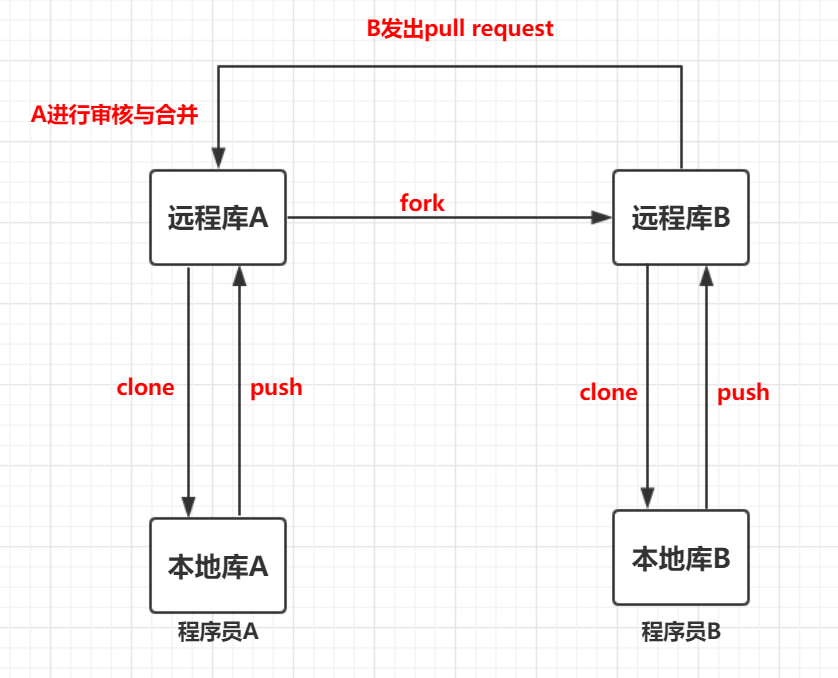

### 远程仓库介绍

远程仓库本质就是一台计算机，该计算机上存储了版本数据

远程仓库分类

| 分类   | 例子                      |
| ------ | ------------------------- |
| 局域网 | 自建gitlab服务器          |
| 互联网 | github \| gitlab \| gitee |


<br/>

### 远程仓库的使用

本地库 --> 远程库

* 将本地库连接远程库

    ```bash
    git remote add 远程库名[默认origin] http协议地址|ssh协议地址
    ```

* 将本地库推送到远程库

    ```bash
    git push 远程库名[默认origin] 分支名
    # git push 等价于下面两个命令
    # git fetch 远程库名[默认origin] 分支名
    # git merge 远程库名[默认origin]/分支名
    ```

* 注意事项：在推送前，本地库必须拥有远程库的最新的修改，否则不能推送

    ```bash
    git pull 远程库名[默认origin] 分支名
    ```

远程库 --> 本地库

* 通过HTTP协议
    ```bash
    git clone https://github.com/username/repositoryname.git
    ```
* 通过SSH协议

    ```bash
    git clone git@github.com:username/repositoryname.git
    ```

<br/>

### 远程免密登录

方式一：远程库地址的URL加用户名和密码

```shell
# 可以在配置文件更改remote地址
git remote add origin https://用户名:密码@github.com/xxx/xxx.git
```

<br/>

方式二：git自动管理凭证

即使用HTTP协议，输入一次账号密码后，就可以将账号密码存进系统中了

<br/>

方式三：通过SSH协议连接

* SSH介绍

  * 本地库与远程库进行数据传输时可以通过两种协议：**HTPP协议**和**SSH协议**
  * HTTP协议：每次连接都输入密码，麻烦但相对安全
  * SSH协议：一旦SSH配置成功，就不用再输入密码，方便但不太安全

* 配置SSH

  * SSH协议基于非对称加密，创建本机的公钥和私钥

    ```bash
    ssh-keygen -t rsa -C 邮箱 
    
    # -t 表示设置加密类型(type)
    # rsa 表示使用rsa加密类型
    # -C 表示设置注释(Comment)
    # 邮箱要与git config user.email的邮箱相同，否则可能无法提交
    ```
  
  * 生成的公钥和密钥在**~/.ssh**目录中，私钥：**id_rsa**，公钥：**id_rsa.pub**
  
  * 在github中加入公钥：**setting -> SSH and GPG keys --> New SSH key**

<br/>

### 远程仓库的工作方式

#### 同团队工作

使用gitflow工作流

gitflow工作流的分支

* master分支：线上版本，稳定版本
* dev分支：开发分支，所有的新开发分支和测试分支都是基于该分支
* 功能/开发分支：由dev分支拆分出来，完成开发后需要提交`pull request`请求合并到dev分支，经过`review`后合并到dev分支
* 测试分支：由dev分支拆分出来，测试过程中修复bug后，合并到dev分支，并提交`pull request`请求合并到master分支，经过`review`后合并到master分支
* hotfix分支：线上代码出现紧急bug时，在该分支上进行修复，修复后合并到master分支

示意图



#### 跨团队协作

背景：A开发一个项目，有本地库和远程库，B想以非团队成员的方式参与项目的开发

流程：
1. B将A的项目fork到自己的远程库中，再从自己的远程库将项目clone下来

2. B更新fork仓库中代码后push到B自己的远程库，在B自己的远程库中通过 pull request 请求合并代码

3. A看到pull request并review通过后，将B的新代码合并到自己的项目分支中；如果review不通过则可以关闭掉这个pull request

示意图



讨论与文档

* issues：讨论和反馈
* wiki：百科和文档

