#### rebase作用

对某一段线性提交历史进行编辑、删除、复制、粘贴

#### rebase特点

合理使用rebase命令可以使提交历史干净、简洁

#### rebase前提

不要通过rebase对任何已经提交到公共仓库中的commit进行修改

<br/>

#### 使用场景1：将多个提交记录整合为一个提交记录

git命令

```shell
git rebase -i [startpoint]  [endpoint] # 左开右闭区间
```

`[startponit]`是最初提交记录，`[endpoint]`是最后提交记录，是一个左开右闭区间【(startpoint, endpoint]】

如果不指定`[endpoint]`，则该区间的终点默认是当前分支`HEAD`所指向的`commit`，可以配合`HEAD^`或`HEAD~n`使用

示范例子：

1. 最初记录

  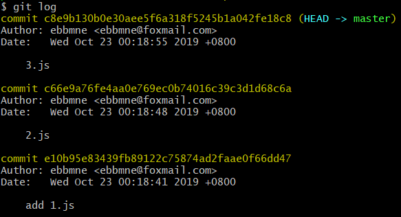

2. 将`2.js`和`3.js`记录进行合并**【注意是左开右闭区间】**

  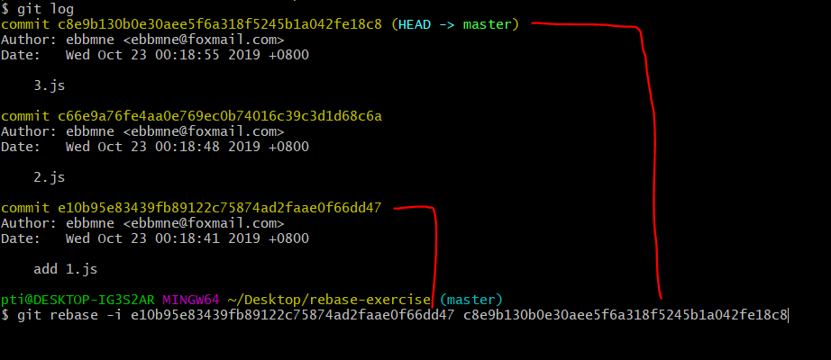

3. 执行完命令后，进入合并选项界面

  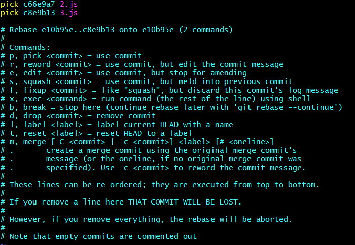

| 选项   | 说明                                                         |
| ------ | ------------------------------------------------------------ |
| pick   | 保留该commit（缩写:p）                                       |
| reword | 保留该commit，但我需要修改该commit的注释（缩写:r）           |
| edit   | 保留该commit, 但我要停下来修改该提交(不仅仅修改注释)（缩写:e） |
| squash | 将该commit和前一个commit合并（缩写:s）**【最常用】**         |
| fixup  | 将该commit和前一个commit合并，但我不要保留该提交的注释信息（缩写:f） |
| exec   | 执行shell命令（缩写:x）                                      |
| drop   | 我要丢弃该commit（缩写:d）                                   |

  通常使用squash选项

  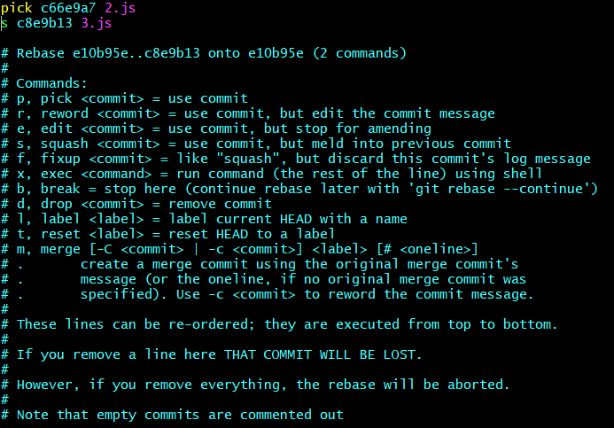

4. 最后进入注释修改界面，用于提供合并后的提交的注释

  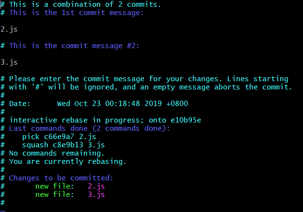

  修改后保存即可完成

  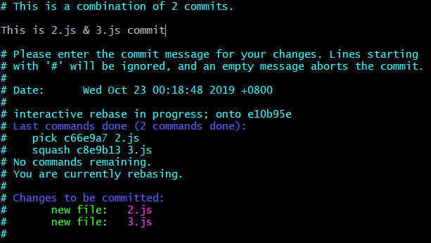

5. 查看结果

  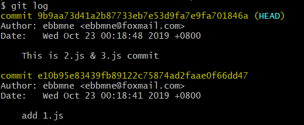

<br/>

#### 使用场景2：让分支A的某段提交粘贴到分支B

当我们项目中存在多个分支，有时候我们需要将某一个分支中的一段提交同时应用到其他分支，如下图

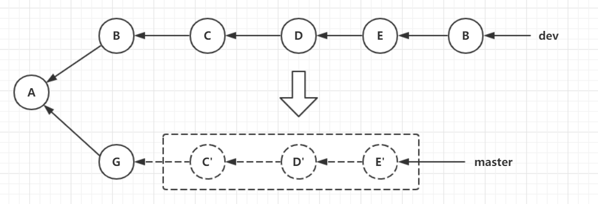

git命令

```shell
git rebase [startpoint] [endpoint] --onto [目标分支名] # 左开右闭区间
```

示例例子：

1. 现在有master和dev两个分支，它们的提交记录如下

    master分支的log

    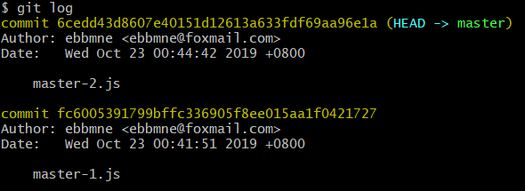

    dev分支的log

    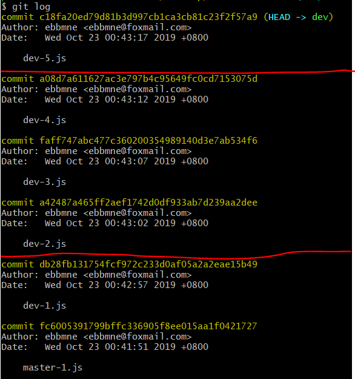

2. 将`dev分支`log的`dev-2.js`到`dev-4.js`的记录粘贴到`master分支`中

    注意：仍然是左开右闭区间

    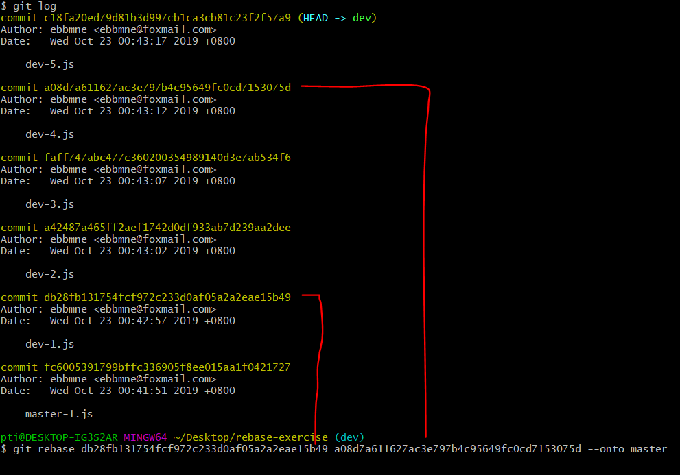

3. 执行完后，HEAD处于游离状态，需要根据提示设置HEAD的指向

    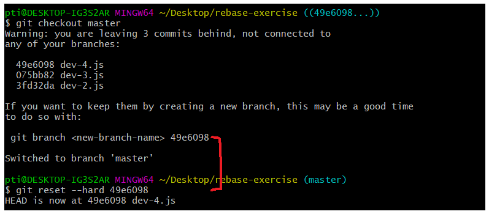

4. 查看合并结果

    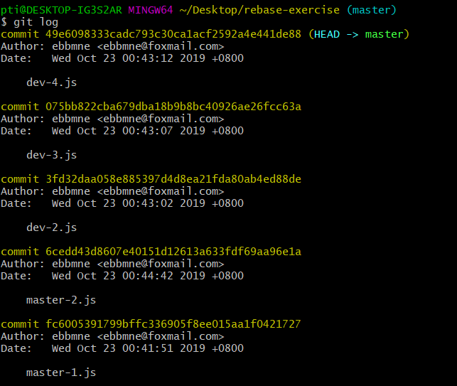