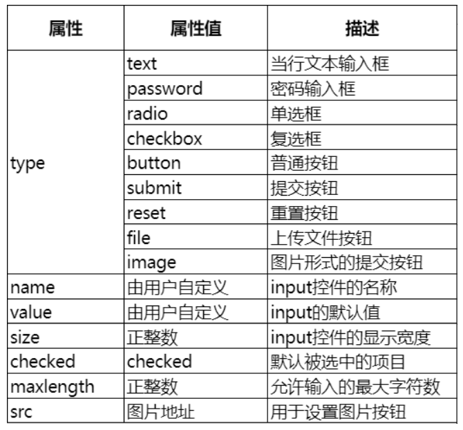
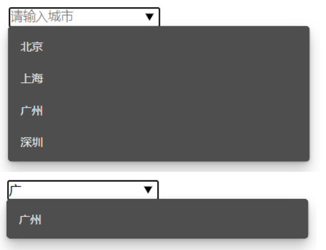
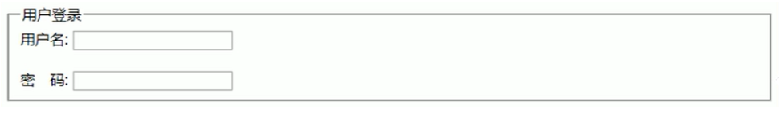

### 表单组成
* 表单域：整个表单的区域，可理解为外层的盒子
* 提示文本：说明性质的文字，用于提示用户进行填写和操作
* 表单控件：包含了具体的表单功能项，如单行文本输入框，密码输入框，复选框，提交按钮，重置按钮等等

--------------------------------------------------------------

### 常用控件和标签

#### input控件

让用户进行信息填写的工具



注意事项：多个radio通过同一个name划分为一组，即多个拥有相同name的radio，只能选择其中一个

#### label标签

label标签用于绑定一个表单控件，当点击label标签时，被绑定表单控件获取输入焦点

使用方法一：直接用label标签进行包裹
```html
<label> 输入账号
  <input type="text" />
</label>
```

使用方法二：使用`for id`的形式进行
```html
<label for="male">男</label>
<input type="radio" name="gender" id="male" value="">
```

#### textarea控件
输入多行的文字

| 属性 | 说明 |
| ---- | ---- |
| rows | 行数 |
| cols | 列数 |

#### select-option控件

下拉菜单

示例
```html
<select>
  <option>选项1</option>
  <option>选项2</option>
  <option>选项3</option>
</select>
```

注意事项
* \<select>\</select>中至少要包含一对\<option>\</option>
* 在option中定义selected="selected"时，当前项即为默认选中项

----------------------------------------------

### 表单域

定义：表单域是一对\<form>\</form>标签，它可以看作是一个盒子，这个盒子包裹表单，即表单域中有表单控件和提示文本

| 属性   | 说明                                                        |
| ------ | ----------------------------------------------------------- |
| action | 需要提交到的服务器的url地址                                 |
| method | 表单提交的HTTP方法，如GET, POST, PUT, DELETE, PATCH, OPTION |
| name   | 指定表单的名称，以区分同一页面中多个表单                    |

示例
```html
<form action="https://www.server.com" method="POST" name="myForm">
</form>
```

----------------------------------------------

### HTML5 input控件增强

| 属性值        | 说明                  |
| ------------- | --------------------- |
| type="email"  | 限制用户输入Email类型 |
| type="url"    | 限制用户输入URL类型   |
| type="date"   | 日期选择控件          |
| type="time"   | 时间选择控件          |
| type="month"  | 月份选择控件          |
| type="week"   | 星期选择控件          |
| type="number" | 限制用户数字类型      |
| type="tel"    | 限制用户输入手机号码  |
| type="search" | 搜索框控件            |
| type="color"  | 颜色选择控件          |
| required      | required              |
| placeholder   | 提示文本              |
| autofocus     | autofocus             |
| autocomplete  | off/on                |
| multiple      | multiple              |

------------------------------------

### datalist

作用：类似于select-option，但提供模糊搜索功能

使用：需要通过id值与input控件配合使用

示例
```html
<input type="text" placeholder="请输入城市" list="city" />
<datalist id="city">
  <option>北京</option>
  <option>上海</option>
  <option>广州</option>
  <option>深圳</option>
</datalist>
```

效果图



---------------------------------

### fieldset

作用：将表单元素进行分组

使用：需要配合`legend`使用，`legend`包裹分组名

使用例子
```html
<fieldset>
  <legend>用户登录</legend>
  用户名：<input type="text" name="username" />
  <br />
  密  码：<input type="password" name="password" />
</fieldset>
```

效果图
