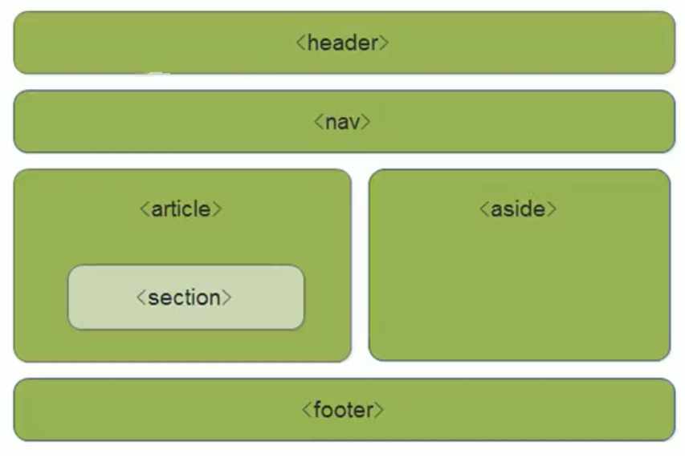

### 新增标签

| 标签    | 说明       |
| ------- | ---------- |
| header  | 头部标签   |
| nav     | 导航标签   |
| article | 内容标签   |
| section | 块级标签   |
| aside   | 侧边栏标签 |
| footer  | 尾部标签   |



-------------------------------------

### 语义化的作用

* div对于搜索引擎和浏览器来说是没有语义的
* 语义化标签主要针对于搜索引擎和浏览器
* 对于搜索引擎：更好的大纲目录，利于SEO
* 对于浏览器：提供更好的辅助阅读功能

----------------------------------------

#### 注意事项

* 语义化标签主要用于移动端
* 在IE9中，这些新的语义标签被当为行内元素，所以需要设置
    ```css
    display: block;
    ```