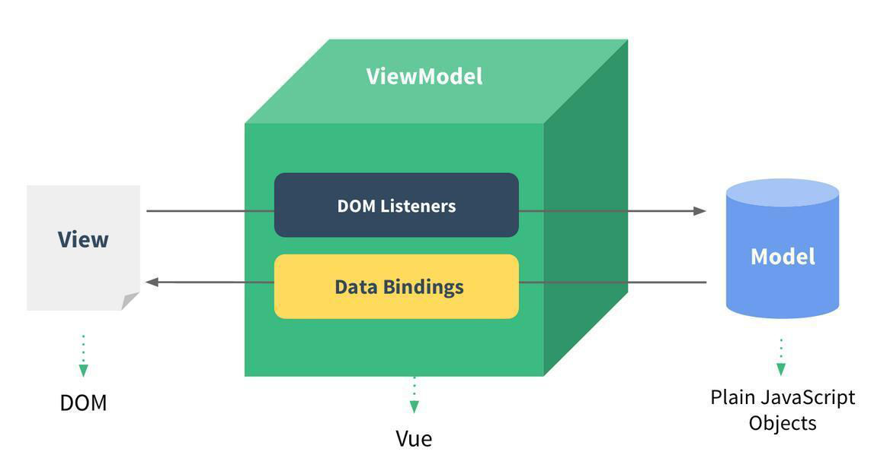

### Vue介绍

Vue发音类似单词view

Vue是一套用于构建用户界面的渐进式框架，便于与第三方库或既有项目整合

Vue框架只关注视图层，负责处理View层和Model层的联系

Vue的技术栈组成：Vue + Vue-Router + Vuex

<br/>

### Vue特点

* 渐进式框架，便于与第三方库或既有项目整合
* 单向数据流，子组件不能直接修改父组件传递过来的数据
* 组件化开发，可实现代码的复用
* 声明式编程，不用写dom操作代码
* 虚拟dom，加快页面渲染速度

<br/>

### Vue的MVVM模式

MVVM：`M(Model)` + `V(View)` + `VM(ViewModel)`

* View层
  * 视图层
  * 前端开发中通常就是DOM层
  * 主要的作用是给用户展示各种信息
* Model
  * 数据层/模型层
  * 存储应用的数据
* ViewModel
  * 视图模型层
  * 视图模型层是View和Model沟通的桥梁
  * 一方面它实现了Data Binding，也就是数据绑定，将Model的改变实时的反应到View中
  * 另一方面它实现了DOM Listener，当DOM发生一些事件时，可以监听到并在需要的情况下改变对应的Data



<br/>

### Vue安装

通过Script标签引入本地文件

```html
<script src="./vue.js"></script>
```

通过Script标签引入CDN文件

```html
<script src="https://cdn.jsdelivr.net/npm/vue/dist/vue.js"></script>
```

通过npm安装

```shell
npm install vue
```

通过脚手架安装

```shell
npm install -g @vue/cli
vue create [项目名]
```

