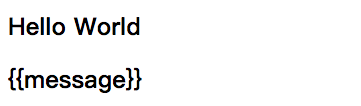

### v-model

作用：进行双向绑定，即View层数据发生改变时，也会同时修改Model层数据，主要用于表单控件

内容：写需要绑定的数据

修饰符

* lazy：失去焦点或者回车时才会更新数据
* number：输入内容自动转成数字类型（默认是字符串类型）
* trim：过滤输入内容左右两边的空格

注意：v-model可以用v-bind和v-on配合实现

```html
<div id="app">
    <input type="text" v-model="username" />
</div>

<script>
    new Vue({
        data: {
            username: ""
        }
    });
</script>
```

等价于

```html
<div id="app">
    <input type="text" :value="username" @input="username = $event.target.value" />
</div>

<script>
    new Vue({
        data: {
            username: ""
        }
    });
</script>
```


-------------------------------------------------

### v-bind、v-on

#### v-bind

作用：①用于设置属性    ②用于向子组件传值

内容：写 JS 表达式

简写：`:`

注意：属性写法和特殊的两个属性

* 直接使用`属性名="属性值"`这种写法，表示属性值单纯是一个字符串，而不是一个JS表达式

* 对于定义class属性，可以设置两种值，分别为数组和对象

  * 值为数组，将数组中的类名添加到标签class属性中

    ```html
    <div :class="[a,b,c,d]"></div>
    
    <!-- 最终渲染出来标签如下 -->
    
    <div class="a b c d"></div>
    ```

  * 值为对象，对象的键为类名，键对应的值为true/false，表示是否要添加该属性

    ```html
    <div :class="{a: true, b: false, c: true}"></div>
    
    <!-- 最终渲染出来标签如下 -->
    
    <div class="a c"></div>
    ```

  * `class`和`v-bind:class`可以合并

* 对于定义style属性，可以设置两种值，分别为数组和对象

  * css属性名称采用驼峰命名，`style`和 `:style`可以合并

  * 值为数组，将数组中的对象添加到标签style属性中

    ```html
    <div id="app">
        <div v-bind:style="[baseStyles, overridingStyles]"></div>
    </div>
    
    <script>
        new Vue({
            el: "#app";
            data: {
                baseStyles: {background: "red"},
                overridingStyles: {fontSize: "100px"}
            }
        });
    </script>
    ```

  * 值为对象，对象健为css属性名称（采用驼峰命名），键对应值为css值

    ```html
    <div :style="{color: currentColor, fontSize: fontSize + 'px'}"></div>
    ```

#### v-on

作用：用于绑定事件及回调函数

内容：写 JS 表达式

简写：`@`

修饰符

* stop：调用 event.stopPropagation()，即阻止冒泡
* prevent：调用 event.preventDefault()，即阻止默认事件
* native：监听原生事件
* once：只触发一次回调

注意：

* 如果事件绑定在HTML5原生标签上，则为原生事件
* 如果事件绑定在组件上，则为自定义事件，哪怕它的名字和原生事件相同，除非使用`native`修饰符
* $event 是事件对象
* 如果 JS 表达式是一个函数，则可以省略 ()，系统会将事件对象 $event 作为第一个参数传递

```html
<div id="app">
    <h2 v-on:click="alert('这是原生鼠标点击事件')">Hello World</h2>
    <Home @click="handleMyFunction(10, $event)"></Home>
</div>

<scirpt>
    new Vue({
        el: "#app",
        methods: {
            handleMyFunction(number, event) {}
        }
    });
</scirpt>
```


-------------------------------------------------

### {{}}、v-text、v-html

#### {{}}  - Mustache语法

位置：写在innerHTML处

作用：用于将数据显示在界面中

注意：如果含有HTML标签，不会进行解析

内容：写 JS 表达式

```html
<div>
    <h2>Hello {{ name }}</h2>
    <h3>{{ 1 + 2 * 3 }}</h3>
</div>
```

#### v-text

作用：用于将数据显示在界面中

内容：写 JS 表达式

注意：

* v-text会覆盖掉innerHTML的内容
* 如果含有HTML标签，不会进行解析

```html
<div>
    <h2 v-text="'Hello' + name">Hello {{ name }}</h2>
    <h3 v-text="1 + 2 * 3 + 100">{{ 1 + 2 * 3 }}</h3>
</div>
```

#### v-html

作用：用于将数据显示在界面中

内容：写 JS 表达式

注意：如果含有HTML标签，则会进行解析

```html
<div>
    <h2 v-html=`"<a href='#'>跳转</a>"`></h2>
</div>
```

-------------------------------------------------

### v-for、v-if、v-show

#### v-for

作用：用于列表渲染

内容：写 JS 表达式

注意：

* 为了提高diff算法效率，需要加入 key

* template占位标签，用于循环时包裹里面元素，但template占位标签本身不会被渲染

* 对于数组更新，触发响应式更新的问题
  * 通过索引改变数组元素，并不会进行响应式更新
  * 通过 push|pop|unshift|shift|reverse|sort|splice 这七个方法更新数组能触发响应式更新
  * 通过 Vue.set(要修改的对象，索引值，新值) 函数能触发响应式更新
  * 直接修改数组的引用也可以触发响应式更新
  
  ```html
  <!-- 对于数组的遍历 -->
  <div id="app">
      <li v-for="(item,index) of array" :key="index">{{ index }} - {{ item }}</li>
  </div>
  ```
  
* 对于数组更新，触发响应式更新的问题

  * 动态地往对象中加属性是不能进行响应式更新
  * 直接修改对象的引用可以触发响应式更新
  * 通过 Vue.set(要修改的对象，索引值，新值) 函数能触发响应式更新

  ```html
  <!-- 对于对象的遍历 -->
  <div id="app">
    <li v-for="(key,value,index) of obj" 
      :key="index">
      {{ index }}-{{ key }}-{{value}}
    </li>
  </div>
  ```

#### v-if

作用：决定标签是否渲染（即dom树中是否有这个节点）

内容：写 JS 表达式

注意：

* 为了避免标签复用问题，需要加上 key
* v-if, v-else-if, v-else 要紧贴在一起

```html
<div v-if="number > 0">
    <input type="text" name="infomation" key="1" />
</div>
<div v-else-if="number === 0">
    <input type="text" name="infomation" key="2" />
</div>
<div v-else>
    <input type="text" name="infomation" key="3" />
</div>
```

#### v-show

作用：决定是否显示标签（即dom中存在该标签，只是决定显示还是隐藏 display: none）

内容：写 JS 表达式

注意：当需要在显示与隐藏之间切片很频繁时，使用v-show；当只有一次切换时，使用v-if

```html
<div v-show="isShow === true">Hello World</div>
```

-------------------------------------------------

### v-once、v-pre、v-cloak

#### v-once

作用：被标记的标签和组件只会渲染一次，不会随着数据的改变而改变，将组件放入内存中，切换时直接使用，性能更高

内容：无

```html
<div>
    <h2 v-once>{{ message }}</h2>
</div>
```

#### v-pre

作用：用于跳过这个元素和它子元素的编译过程，显示原本的Mustache语法

内容：无

```html
<div>
    <h2>Hello World</h2>
    <h2 v-pre>{{ message }}</h2>
</div>
```

渲染结果



#### v-cloak

作用：为未编译渲染完成的标签添加`[v-cloak]`样式，在编译渲染完成后移除`[v-cloak]`样式

内容：无

```html
<style>
    [v-cloak] {
        display: none;
    }
</style>

<div>
    <h2 v-cloak>{{ message }}</h2>
</div>
```

--------------------------

### ref、is

#### ref

作用：用于标记标签或组件，从而可以通过`$refs`获取该标签或组件对象

内容：字符串

```html
<div>
  <span ref="refcpn">内容</span>
</div>

<script>
  console.log(this.$refs.refcpn.innerHTML); // 内容
</script>
```

#### is

作用：用于指定实际显示的标签/组件

内容：写 JS 表达式

##### 使用场景：解决HTML5标签的问题

HTML5规定某个位置标签必须是特定的标签，否则浏览器可能解析错误，比如

* tbody中必须写tr
* ul/ol中必须写li
* select中必须写option

但有时我们希望是自定义的属性，则可以使用`is`来进行指定

```html
<!-- row为自定义的组件 -->
<table>
  <tbody>
    <tr is="row"></tr>
    <tr is="row"></tr>
  </tbody>
</table>
```

#### 使用场景：动态组件

在组件处定义`v-bind:is="type"`，可以通过改变`type`的值，来动态改变显示的组件

```html
<component :is="type"></component>
```


