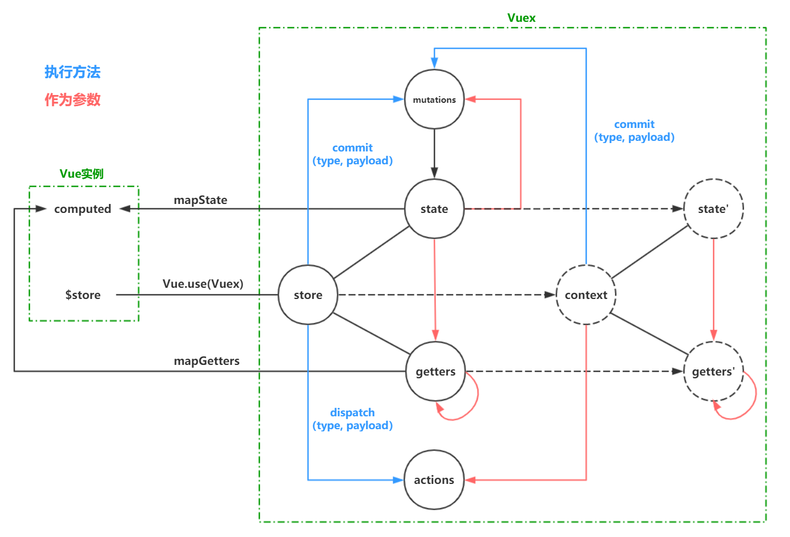

### 初识Vuex

#### Vuex是什么

`Vuex`是`Vue`的状态管理工具，用来管理应用中的全局数据

#### 为什么需要Vuex

在应用中，可能存在多个组件都需要使用到的数据（比如用户的登录状态、用户名称、头像、地理位置信息等等），有以下解决方案

* 通过父子组件之间传递数据，缺点是如果组件之间相距较远，则数据需要在组件中逐级传递，哪怕中间参与的组件并不需要使用这些数据，即会造成数据管理的混乱

* 创建全局对象，并将这个对象绑定到`Vue`的原型对象上，缺点是无法进行响应式更新

这时，就需要使用`Vuex`了，它是一个全局单例的对象，所有组件都可以直接通过`Vuex`获取、设置或更新数据，且它能进行响应式的更新

#### Vuex下载与安装

```shell
# 通过npm
npm install vuex --save
# 通过yarn
yarn add vuex
```

<br/>

### Vuex的store

`store`是一个全局单例对象，通过使用`Vuex`的`Vuex.Store`方法进行创建

```js
import Vue from "vue";
import Vuex from "vuex";

Vue.use(Vuex);

const store = Vuex.Store({
    state: {},
    getters: {},
    mutations: {},
    actions: {},
    modules: {}
});

export default Store;
```

`store`挂载到`Vue`上，组件通过`$store`属性访问`store`对象，从而与`Vuex`进行通讯

```js
import Vue from "vue";
import App from "./App";
import store from "./store";

new Vue({
  el: "#app",
  store,
  render: h => h(App);
});
```

<br/>

### Vuex工作流



| 方法     | 参数             |
| -------- | ---------------- |
| getter   | state, getters   |
| mutation | state, payload   |
| action   | context, payload |

| 方法     | 参数                        |
| -------- | --------------------------- |
| getter   | state, getters, rootState   |
| mutation | state, payload, rootState   |
| action   | context, payload, rootState |

<br/>

### state

`state`是一个对象，用来存储`store`的数据

组件通过`this.$store.state`属性的方式来访问`store`中的数据

注意不要通过`this.$store.state`的方式直接修改`store`中的数据，这样不能实现响应式更新，也不能被`devtools`检测到

<br/>

#### getters

`getters`是一个对象，对象中的属性是`getter`

`getter`能够提供对`state`进行逻辑计算后的属性，类似于`Vue`的计算属性

每个`getter`是一个函数，该函数接收的参数是`state`和`getters`

```js
const store = new Vuex.Store({
  state: {
    count: 0
  },
  getters: {
    greateAgesCount: (state, getters) => {
      return state.students.filter(s => s.age >= 20).length;
    }
  }
});
```

`getter`是不能接受参数的，如果希望`getter`能够接受参数，则可以让`getters`本身返回一个函数

```js
const store = new Vuex.Store({
  state: {
    count: 0
  },
  getters: {
    stuByID: (state, getters) => {
      return id => {
        return state.students.find(s => s.id === id);
      }
    }
  }
});
```

<br/>

### mutations

#### mutations作用

`mutations`定义数据更新的方法，`store`进行数据响应式更新的唯一方式是执行`mutations`中的函数

#### mutation函数定义

`mutations`是一个对象，对象中的属性是函数，其中属性名称为`type(事件类型)`，函数体称为`handler(回调函数)`，执行这些函数时`Vuex`会自动将`state`作为第一个参数传递进来

```js
const store = new Vuex.Store({
  state: {
    count: 0
  },
  mutaions: {
    increment(state, payload) {
      state.count++;
    },
    decrement(state, payload) {
      state.count--;
    }
  }
});
```

#### 执行mutations函数

执行`mutations`中的函数，需要调用`store`的`commit`方法，有两种风格

##### 风格一：参数是`type`和`payload`

```js
this.$store.commit(type, payload)
```

当需要传入多个参数时，需要将参数组成一个对象

```js
this.$store.commit(type, {count: 1, index: 0});
```

##### 风格二：参数是一个对象，对象有属性`type`和`payload`

```js
this.$store.commit({
  type: type,
  payload: payload
});
```

#### 触发mutations响应式更新

在`state`中定义初始数据，如果直接通过`this.$store.state`来更新数据是不会进行响应式更新的

通过`Vue.set(对象, 属性, 值)`的方式或直接赋值新对象的方式进行新增或更新数据

通过`Vue.delete(对象, 属性)`的方式来删除数据

#### 常量type

因为`mutations`中的`type`都是字符串，为了避免写错和一改全改，可以将`type`放在一个专门的文件中，定义为字符串常量

```js
// mutation-types.js
export const INCREMENT = "increment"
export const DECREMENT = "decrement"

// store/index.js
import * as types from "./mutation-types";

const store = new Vuex.Store({
  state: {
    count: 0,
  },
  mutations: {
    [types.INCREMENT]: state => {
      state.count++;
    },
    [types.DECREMENT]: state => {
      state.count--;
    }
  }
})
```

#### mutations函数要求

`Vuex`要求`mutations`函数中都是同步操作，而不能存在异步操作

如果存在异步操作，则`devtools`无法进行跟踪

<br/>

### actions

#### actions作用

`actions`作用类似于`mutations`，都是定义数据更新的函数，区别在于`actions`中的函数可以有异步操作

#### action函数定义

`actions`是一个对象，对象中的属性是函数，其中属性名称为`type(事件类型)`，函数体称为`handler(回调函数)`，执行这些函数时`Vuex`会自动将`context`作为第一个参数传递进来

```js
const store = new Vuex.Store({
  state: {
    count: 0
  },
  mutaions: {
    increment(state) {
      state.count++;
    }
  },
  actions: {
    increment(context) {
      context.commit("increment");
    }
  }
});
```

#### context理解

`context`是和`store`对象具有相同方法和属性的对象，但`context`和`store`不是同一个对象，相当于`context`是`store`的克隆

**通过`context`去执行`commit`操作，从而更改`store`存储的数据**

#### 执行actions函数

执行`actions`中的函数，需要调用`store`的`dispatch`方法，有两种风格

##### 风格一：参数是`type`和`payload`

```js
this.$store.dispatch(type, payload)
```

当需要传入多个参数时，需要将参数组成一个对象

```js
this.$store.dispatch(type, {count: 1, index: 0});
```

##### 风格二：参数是一个对象，对象有属性`type`和`payload`

```js
this.$store.dispatch({
  type: type,
  payload: payload
});
```

<br/>

### modules

#### modules作用

`Vue`使用单一状态树，这意味着很多状态都会交给`Vuex`来管理，当应用变得非常复杂时,store对象就有可能变得相当臃肿

为了解决这个问题，`Vuex`允许我们将`store`分割成多个`模块[Module]`，可以理解为多个`小store`，每个模块拥有自己的`state`、`getters`、`mutations`和`actions`

```js
// 用户信息相关
const moduleA = {
  state: {},
  getters: {},
  mutations: {},
  actions: {}
}

// 应用版本信息相关
const moduleB = {
  state: {},
  getters: {},
  mutations: {},
  actions: {}    
}

// 网络请求信息相关
const moduleC = {
  state: {},
  getters: {},
  mutations: {},
  actions: {}    
}

// 添加多个modules到store中
const store = new Vuex.Store({
  modules: {
    a: moduleA,
    b: moduleB,
    c: moduleC
  }
});
```

#### modules特点

虽然每个`module`都有自己的`state`、`getters`、`mutations`、`actions`，但是在添加到`store`后，会合并进行`store`里面，使用时不关心内部实现

`mutations`中的`state`参数有`rootState`属性，可以访问到`store`的`state`

`actions`中的`context`参数有`rootState`属性，可以访问到`store`的`state`


